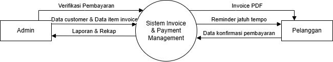
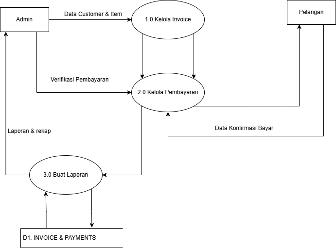

# 🚀 Tugas Besar: [InvoPay:System Invoice & Payment Management]
> **Dosen Pengampu:** Muhammad Shiddiq Azis, S.T., MBA
---
## 📊 Perancangan Sistem (DFD)
### DFD Level 0

**Diagram Konteks yang menunjukkan aliran data global.**
### DFD Level 1

Proses 1.0 (Kelola Invoice): Menangani input dari Admin berupa "Data customer & Data item invoice". Proses ini menghasilkan "Invoice PDF" dan "Reminder jatuh tempo" untuk Pelanggan. Data ini disimpan ke database (Data Store).

Proses 2.0 (Kelola Pembayaran): Menampung "Data konfirmasi pembayaran" dari Pelanggan. Admin kemudian melakukan "Verifikasi Pembayaran" melalui proses ini untuk mengubah status invoice menjadi lunas.

Proses 3.0 (Buat Laporan): Mengambil semua data yang sudah tersimpan di database untuk diolah menjadi "Laporan & Rekap" yang diserahkan kembali ke Admin.

Admin: Pengelola sistem yang memiliki hak akses penuh terhadap pembuatan invoice, verifikasi, dan laporan.
Pelanggan: Penerima layanan yang melakukan transaksi dan pembayaran.

Data Store (D1. Invoice & Payments): Berfungsi sebagai pusat basis data (database) yang menyimpan seluruh riwayat transaksi, detail item, dan status pembayaran agar data tetap konsisten dan aman.

---
## 🎨 Mockup Antarmuka
Rancangan UI aplikasi yang berfokus pada pengalaman pengguna.
| Login Page | Dashboard | Core Feature |
| :---: | :---: | :---: |
|  |  |  |
---
## 🛠️ Stack Teknologi
- **Frontend:** Next.js
- **Backend:** Node.js
- **Database:** MySQL
---
## 📂 Cara Instalasi
1. `git clone [url-repo]`
2. `npm install` (atau sesuaikan dengan environment)
3. `npm run dev
